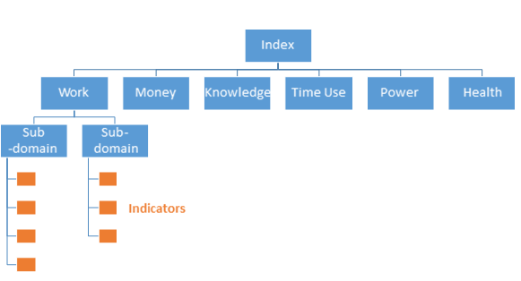

```{r, include = FALSE}
for (script in list.files("scripts", full.names = TRUE)) {
  source(script)
}
```

# Background and Methodology

## Background   

In 2017, the Scottish Government carried out an initial exploratory piece of work with a view to developing a new Gender Equality Index, and produced a [working paper](https://www2.gov.scot/Topics/People/Equality/Equalities/GenderIndex) which describes the process that it followed at that time. This considered whether or not Scotland should replicate an already internationally-established Index, produced by the [European Institute for Gender Equality (EIGE)](https://eige.europa.eu/gender-equality-index/2020).  However, this exploratory work found that data limitations made full replication of this index unworkable. 

A process of consultation with external stakeholders was conducted, and a Scottish Government-led working group with prominent women's organisations and academics was set up to advise on the development of a Gender Equality Index. The working group comprised of Scottish Government analysts with expertise on the available data sources, and stakeholders providing expertise on gender inequality across each of the domains.

To best meet user needs, we decided to build a new bespoke index that uses some of the features of the EIGE index, but with a more Scotland appropriate selection of indicators. This new Index would be designed to set a baseline and monitor change at Scotland level through time.  

This publication presents baseline data for this set of indicators. As this is a first release we acknowledge that it may not be perfect and there will be some scope for the indicator set to evolve, however it should be noted that any change to the indicator set may affect the Index's primary purpose which is to measure Scotland's progress through time towards gender equality.  

It was considered whether or not it would be possible to use the new index to compare Scotland to other countries across Europe. However, the existing data available for Scotland would have limited the comparability with European data sources. Instead, we have developed a Scotland-specific set of indicators that better reflect the Scottish context, and will allow gender equality in Scotland to be monitored over time.

The intended audience for this Index is broad and includes the public, the media and policy makers who aren't data experts but have an interest or a role in advancing gender equality.  The Scottish Government publishes sex and gender-disaggregated breakdowns in many of its statistical publications and tools such as the [Equality Evidence Finder](http://www.equalityevidence.scot/) help users to locate these.  However, it can be difficult for policy makers to easily access an up-to-date picture which encompasses the many facets of gender equality.  It is hoped that this new Scottish Gender Equality Index will help fill this gap.  

It is expected that Scotland's index will be updated in full every three years. Although some of the data are routinely collected and updated annually e.g. much of the work domain, other parts of the index require specially commissioned work. Time use data is expensive to collect and hence is only gathered periodically by the ONS - to gain robust data for Scotland, an additional sample boost has to be commissioned. Some of the 'money' indicators were collected through a bespoke Scottish Social Attitudes survey module, and the 'power' domain predominantly relies on research which would require recommissioning for each update. In other areas, e.g. the gender pay gap, annual variability means that it is often more prudent to look back longer than a year to get a sense of the overall trend.  

Composite Indexes and Measurement frameworks have value because they bring together a range of indicators, and by comparing them across places and over time this will help a wider audience to judge whether progress is being made and where key challenges remain. This new Gender Equality Index will also hopefully help this audience to understand that in order to successfully tackle gendered issues, such as the gender pay gap, action needs to be taken in many different domains and at different stages of women and men's lifetimes.  It was decided by experts at an initial workshop that an 'Index' would be preferable to a 'Measurement Framework' due to greater simplicity of its messaging and presentation.  However, it was noted that care would have to be taken to ensure that users do not make direct comparisons between the Scottish Index and the EIGE Index. It was also agreed that the Scottish Government should host the final publication.    

From the beginning, it was envisaged that this first attempt will be primarily a learning experience and that it was likely that we would need to work on this for a number of years before we had a robust complete index for Scotland.

## Structure of the Index

Whilst we have used a different basket of indicators, the index is structured and derived in a similar way to the EIGE index.

The index comprises of six core domains. Each domain in turn comprises of two or three sub-domains. Finally, each subdomain contains 2-4 indicators.



Each indicator is given a gender equality score of between one (complete inequality between women and men) and 100 (complete equality). These indicators are aggregated into a sub-domain gender equality score, which are in turn aggregated into domain and overall index equality scores.

There are also a number of additional indicators in “satellite” domains not included in the main index, where comparing women and men isn’t meaningful (women-specific healthcare), or where the goal is eradication rather than equal rates for women and men (violence against women).

## Calculating the Gender Equality Index

The steps involved in calculating the index are: -

1. Selection and processing of indicators. Indicators were selected following discussions with the expert working group and with advice from SG analysts around data availability and suitability.
2. Calculate the gender score metric. The gender gaps are transformed into a gender score metric for each indicator. It is dimensionless (allowing comparability since measurement units of variables have been eliminated), and bound between one (full inequality) and 100 (full equality).
3. Calculating the index (aggregating, weighting, and normalisation)
    a. Aggregation of variables of each sub-domain, creating indices at the subdomain level (value bound [1, 100]), and using arithmetic mean of the indicator equality scores
    b. Aggregation of the sub-domains into domains, using `r bootstrap_tooltip("geometric means", "The geometric mean is an alternative to the standard (arithmetic mean) average. The geometric mean is like the arithmetic mean but multiplies values together rather than adding")` of the six domain scores, by applying experts’ weights to the domains, obtained through the `r bootstrap_tooltip("analytic hierarchy process", "Analytical Hierarchy Process is a technique for analysing decisions through combining each expert's rankings of the relative importance of each domain compared with each other domain")` (AHP).

## Selecting the Indicators

Indicators were selected based on the criteria:

* Measure a relevant aspect of gender equality
* Be in an area where full equality, rather than universal elimination, is the desirable outcome
* Minimise any conceptual overlap
* Demonstrate differences between men and women
* Be based on robust and reliable data

A similar number of indicators have been included within each domain. This publication is using 2018 as the base year, as 2018 data was available for most indicators. Where this wasn’t possible, the closest available year was used. The indicator scores calculated from this data are considered to be '2020' gender index scores. The indicators use 'official statistics' unless otherwise specified in the methodology. For some indicators, newer data is available and can be found on the [Equality Evidence Finder](http://www.equalityevidence.scot) and in the source publications.

## Gender Equality Scores

Indicator data is transformed so that it is on a consistent scale, allowing different gender equality scores to be compared.

The calculation used by EIGE involves: -

1. Expressing indicator data for women and men in relative terms (where applicable). E.g. “% of working-age women in employment” instead of “Number of women in employment”. This accounts for any differences in the size of the reference populations for women and men
2. Compute the value of the ratio of women to the mid-point of men and women, subtract one and take the absolute value to produce a score between 0 and 1 (with the equality point at zero).
3. The complementary value of the indicator is taken, to reverse the direction of the scale, producing a score between 0 and 1 where 1 stands for complete gender equality. This aids interpretation by making high scores correspond to the desirable outcome.
4. The final metric is rescaled so that it is bound between 1 and 100. Scale starts from 1 rather than 0, as using 0 would impede using the `r bootstrap_tooltip("geometric mean", "The geometric mean is an alternative to the standard (arithmetic mean) average. The geometric mean is like the arithmetic mean but multiplies values together rather than adding")` when aggregating

$$1+99\left(1- \left| \frac{women}{\frac{1}{2}(women+men)} - 1\right|\right)$$


> Gender equality scores measure the relative gap between women and men, with higher scores given where the relative difference is small compared to the overall value. A percentage point difference between women and men will give a different score depending on the mid-point value. This means that indicators will give different equality scores, depending on the direction of the scale.

For consistency, all indicators scores are calculated based on the high values representing the desirable outcome. For some indicators such as underemployment, this requires reversing the direction of the scale (i.e. using "% of adults **not** underemployed") as not being underemployed is the desirable outcome of the indicator.

### Example - Health Risks Indicator
```{r}
var <- "health_risk"
metadata <- data[[var]] %>% filter(row_number() == 1)
women_pct <- data[[var]] %>% filter(gender == "women") %>% pull(value) 
men_pct <- data[[var]] %>% filter(gender == "men") %>% pull(value) 
```

The proportion of women with two or more risk behaviours in 2018 was `r round(women_pct)`% and the proportion of men was `r round(men_pct)`%.

For this indicator, the more healthy option corresponds to lower percentages. So we first reverse the direction of the scale to give the proportion of adults with one or fewer health risk behaviours (women: `r round(100-women_pct)`; men: `r round(100-men_pct)`).

We then compare the women's value (`r round(100-women_pct)`) to the mid-point between the women's and men's value `r paste0("$\\frac{1}{2}(",round(100-women_pct),"+",round(100-men_pct),")=",mean(round(c(100-women_pct,100-men_pct))),"$")` to give a gender equality score of `r paste0("$$1+99\\left(1- \\left| \\frac{",round(100-women_pct),"}{",mean(round(c(100-women_pct,100-men_pct))),"} - 1\\right|\\right) = 1+99\\left(1-",round(abs(1 - (100-women_pct)/mean(round(c(100-women_pct,100-men_pct)))), 2),"\\right)=",round(1+99*(1-abs(1 - (100-women_pct)/mean(round(c(100-women_pct,100-men_pct)))))),"$$")`


## Domain Weightings

The approach used for aggregating indicators is similar to that of the EIGE index. Arithmetic and `r bootstrap_tooltip("geometric means", "The geometric mean is an alternative to the standard (arithmetic mean) average. The geometric mean is like the arithmetic mean but multiplies values together rather than adding")` are different methods for calculating averages. The arithmetic mean is the standard way to calculate an average, and was used when aggregating indicators into sub-domains. The `r bootstrap_tooltip("geometric mean", "The geometric mean is an alternative to the standard (arithmetic mean) average. The geometric mean is like the arithmetic mean but multiplies values together rather than adding")` is an alternative method in which high scores balance out low scores to a lesser extent than with the arithmetic mean. This means that a low sub-domain score will bring down the domain score by a greater amount.

* Equally weighted indicators, aggregated into a sub-domain score using the arithmetic mean
* Equally weighted sub-domains, aggregated into a domain score using the `r bootstrap_tooltip("geometric mean", "The geometric mean is an alternative to the standard (arithmetic mean) average. The geometric mean is like the arithmetic mean but multiplies values together rather than adding")`
* Expert weighted domains, aggregated into an index score using the `r bootstrap_tooltip("geometric mean", "The geometric mean is an alternative to the standard (arithmetic mean) average. The geometric mean is like the arithmetic mean but multiplies values together rather than adding")`

An `r bootstrap_tooltip("analytic hierarchy process", "Analytical Hierarchy Process is a technique for analysing decisions through combining each expert's rankings of the relative importance of each domain compared with each other domain")` approach was used to derive domain weightings, with members of the working group informing the final weightings to reflect the priorities in Scotland. Members of the working group were asked to rate the relative importance of the 15 pairs of domains (e.g. is work more/less important than money?; work vs time). 

The domain weights used are:

<div style = "max-width:300px">
Domain    | Weight
--------- | -----:
Time Use  | 27
Work      | 21
Power     | 19
Money     | 18
Knowledge | 8
Health    | 7
</div>

<script type="text/javascript">
$(document).ready(function(){
    $('[data-toggle="tooltip"]').tooltip({
    });
});
</script>
# Acknowledgements

The Scottish Government acknowledges and thanks the expert working group who advised it on the development of the index over a two year period.  The group was comprised of colleagues from the following organisations:

* Close the Gap

* EHRC Scotland

* Engender

* Equate

* WiSE

* Women's Enterprise Scotland

These colleagues provided a great deal of experience and a breadth of expertise and we are very grateful for their contribution.  We do however recognise that this is not a complete and exhaustive list of women's organisations across Scotland.  

We would also like to thank all the Scottish Government lead analysts who contributed to the project.

This report was produced by the Equality Analysis team at the Scottish Government.

